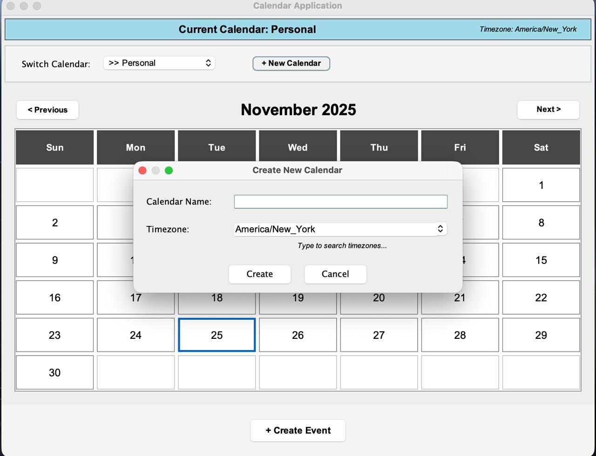
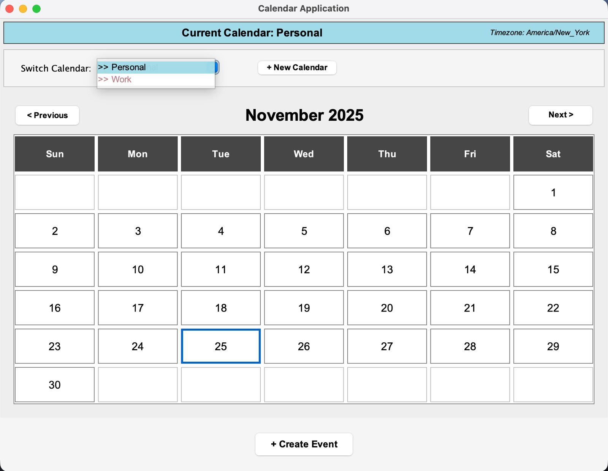
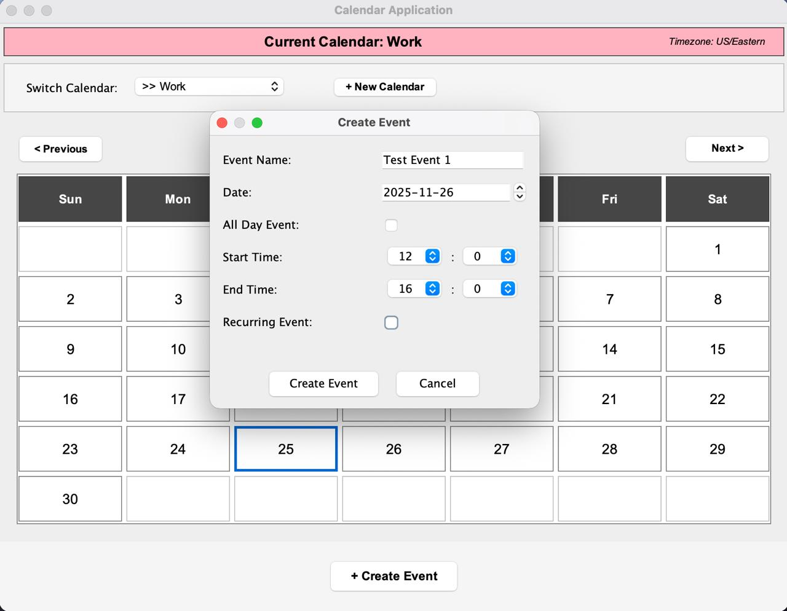
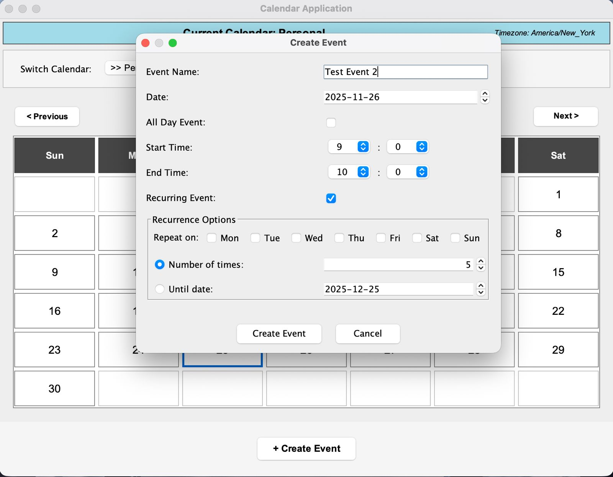
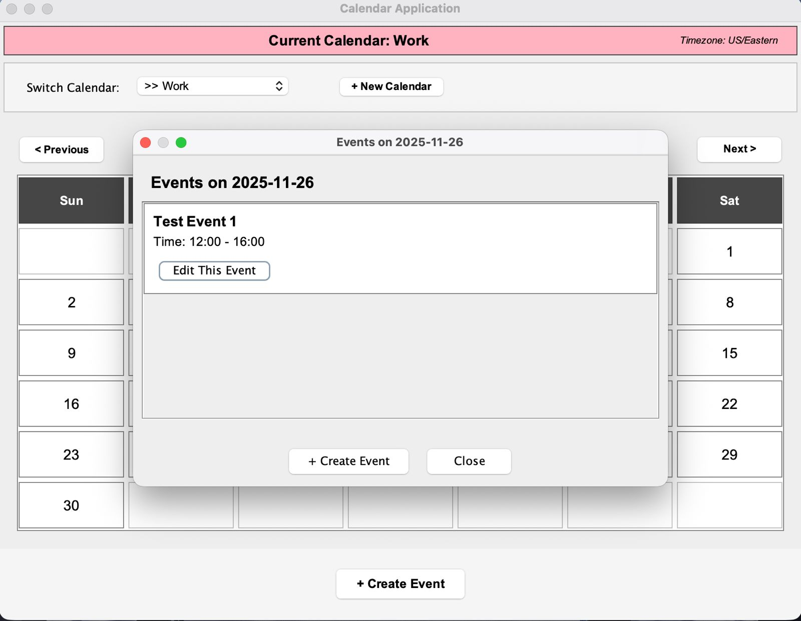
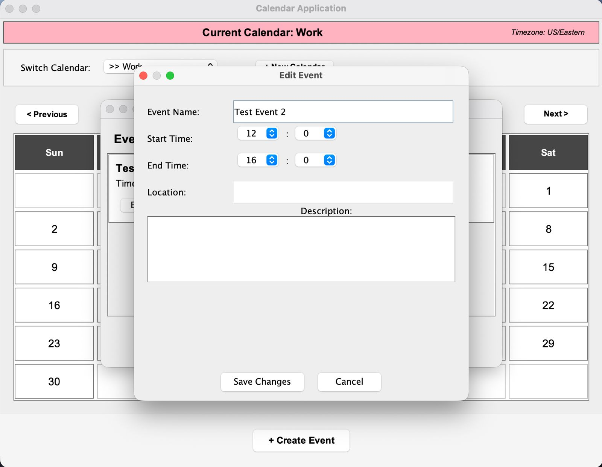
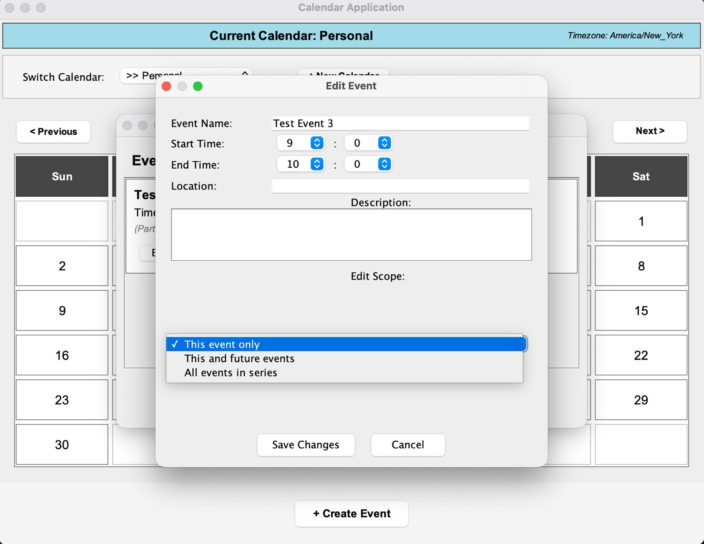

# Calendar Application - USEME

## Build & Run

**Build the JAR:**
```bash
./gradlew clean jar
```
**Run GUI Mode (Default):**
```bash
java -jar build/libs/calendar-1.0.jar
```
**Run Interactive Mode:**
```bash
java -jar build/libs/calendar-1.0.jar --mode interactive
```

**Run Headless Mode:**
```bash
java -jar build/libs/calendar-1.0.jar --mode headless src/res/commands.txt
```

## Using the Graphical User Interface (GUI)
- Ensure you have built the JAR file as shown above.
- Run the program without any arguments to launch the GUI. OR Copy the command shown above and run it in the terminal or run the main method from the `CalendarRunner.java`.

### Creating a Calendar
- There will always be a default calendar named "Personal" created automatically in your local timezone.
- Click "New Calendar" button in top panel
- Enter calendar name
- Select timezone from dropdown
- Click "Create"


### Switching Calendars
- Use the "Switch Calendar:" dropdown in top panel
- Select desired calendar from list
- Calendar grid updates to show events from selected calendar


### Creating Events
- Click "Create Event" button at bottom, OR
- Click any day in the calendar grid
- Check "All Day" for all-day events
- For recurring events, check "Recurring" and select weekdays, frequency (number of occurrences or end date)
- Click "Create"



- The options for recurring events are shown in the screenshot below:
  

### Editing Events
- Click day with events
- Click "Edit This Event" button on desired event
- Modify any field (name, time, location, description)
- For recurring events: select edit scope (this event only, this and future, or all events)
- Click "Save Changes"



- The fields for editing an event are shown in the screenshot below:
  

- The options for editing recurring events are shown in the screenshot below:
  

### Visual Indicators
- Colored day cells indicate events (each calendar has unique color)
- Blue border highlights today's date
- Event count shown below day number
- Timezone displayed in top panel

## Quick Start(Interactive/Headless)

You MUST create and use a calendar before doing anything:
```
create calendar --name Personal --timezone America/New_York
use calendar --name Personal
```

Now you can create events!

## Commands

### Calendar Stuff
```
create calendar --name Personal --timezone America/New_York
use calendar --name Work
edit calendar --name Personal --property name MyCalendar
edit calendar --name Personal --property timezone Europe/Paris
```

### Creating Events

**Simple event:**
```
create event Meeting from 2025-05-05T10:00 to 2025-05-05T11:00
create event "Team Standup" from 2025-05-05T09:00 to 2025-05-05T09:30
```

**All-day event:**
```
create event Holiday on 2025-12-25
```

**Recurring events:**
```
create event Standup from 2025-05-05T09:00 to 2025-05-05T09:30 repeats MWF for 10 times
create event Review from 2025-05-05T14:00 to 2025-05-05T15:00 repeats MW until 2025-06-30
create event Gym on 2025-05-05 repeats MWF for 12 times
create event Weekend on 2025-05-03 repeats SU until 2025-12-31
```

Weekdays: M=Mon, T=Tue, W=Wed, R=Thu, F=Fri, S=Sat, U=Sun

### Editing Events
```
edit event subject Meeting from 2025-05-05T10:00 with "Team Sync"
edit events location Standup from 2025-05-10T09:00 with "Room 202"
edit series description Meeting from 2025-05-05T10:00 with "Updated description"
```

Properties: subject, start, end, description, location, status (PUBLIC/PRIVATE)

### Copying Events
```
copy event Meeting on 2025-05-05T10:00 --target Work to 2025-06-05T14:00
copy events on 2025-05-05 --target Work to 2025-06-05
copy events between 2025-05-01 and 2025-05-31 --target Work to 2025-09-01
```

### Viewing Events
```
print events on 2025-05-05
print events from 2025-05-01T00:00 to 2025-05-31T23:59
show status on 2025-05-05T14:30
```

### Export
```
export cal calendar.csv
export cal calendar.ical
```

File path is printed after export.

### Exit
```
exit
```

## Example Session
```
create calendar --name Personal --timezone America/New_York
use calendar --name Personal
create event "Morning Standup" from 2025-05-05T09:00 to 2025-05-05T09:30 repeats MTWRF for 10 times
create event Lunch on 2025-05-05
print events on 2025-05-05
create calendar --name Work --timezone America/Chicago
copy events on 2025-05-05 --target Work to 2025-06-01
export cal personal.ical
exit
```

## Notes

- Date format: `YYYY-MM-DD` (e.g., `2025-05-05`)
- DateTime format: `YYYY-MM-DDTHH:MM` (e.g., `2025-05-05T14:30`)
- Use quotes for event names with spaces: `"Team Meeting"`
- Headless mode files must end with `exit`
- Timezones auto-convert when copying between calendars
- Changes.md file is kept in res. This file tracks the design changes made from the previous assignment.

### GUI Mode
- Default "Personal" calendar created automatically on startup
- Time selection uses dropdowns (hour 0-23, minutes in 15-min intervals)
- All input validated before submission
- File chooser opens native file browser for exports
- Calendar colors rotate through 5 predefined colors